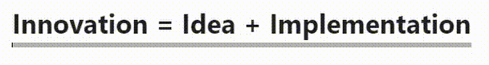
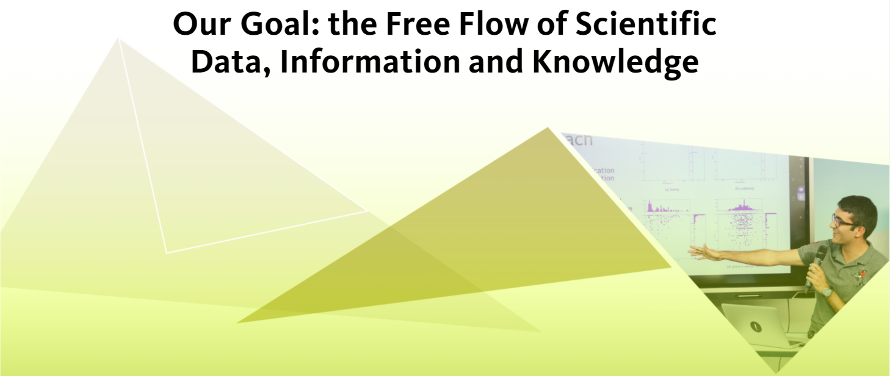

<h2 style="text-align: center;"><b>Welcome to</b></h2>

 

    

 

# About
Our mission is to help students, researchers and educators unleash their full potential by boosting ideas that support discovering, accessing, using or sharing scientific information and knowledge. See more on our [website](https://www.librarylab.ethz.ch/about/).

    

 
 
<!-- 

    <strong>
    Our Goal: the Free Flow of Scientific Data, Information and Knowledge
    </strong>

 -->

# Projects on Github

We are focussed on bringing projects to a prototype or MVP level at which point they can be shared, utilised and seek support for further development.

Some repos will be ready to reproduce and run end-to-end, others may be in the early experimental development stages. If you are interested in discussing any of our projects please get in touch via our [contact form](https://www.librarylab.ethz.ch/contact/).

Not all of our projects are listed here on Github, so please check out our website for list of all Library Lab [projects](https://www.librarylab.ethz.ch/projects/)

## Projects

### Filsat
| | |
|-------|-------|
| repo  |  <a target="_" href="https://github.com/eth-library-lab/filsat">eth-library-lab/filsat</a> |
| about |  A transition platform for open source code and online coding tutorials.     |
| tech  |   Stencil, GraphQL, NodeJS, Django     | 
| status| finished |

 

### inDexDa

| | |
|-----|-------|
| repo | <a target="_" href="https://github.com/eth-library-lab/inDexDa">eth-library-lab/inDexDa</a> |
| about | Automated identification and indexing of datesets in academic papers using NLP|
| tech | NLP, webscraping, Tensorflow, BERT,       |  
| status | finished | 
  
 

### BioDex

| | |
|-----|-------|
| repo | <a target="_" href="https://github.com/eth-library-lab/biodex--mobile-app">eth-library-lab/biodex--mobile-app</a>  |
| about | Automated species identification of butterflies with a mobile app designed for Natural History Museums |
| tech | React Native, Django |
| status| finished |

 

### Image Search

| | |
|-------|--------|
| repo  | <a target="_" href="https://github.com/eth-library-lab/graph-such">eth-library-lab/graph-such</a>       |
| about | Image retrieval tool used to search for similar images in an archive and find relevant metadata |
| tech  | Vue, Django, Tensorflow, Docker       | 
| status| active |

 

### herbaria--plant-labeling

| | |
|-------|--------|
| repo  | <a target="_" href="https://github.com/eth-library-lab/herbaria--plant-labeling">eth-library-lab/herbaria--plant-labeling</a>       |
| about | Image segmentation model for labelling plant structures in herbarium samples in the family Brassicaceae |
| tech  | Tensorflow, MaskRCNN | 
| status| exploratory |

 

<!-- copy format below for new tables

### ProjectName

| | |
|--------|--------|
| repo   |        |
| about  |        |
| tech   |        | 
| status |        |

 

-->

